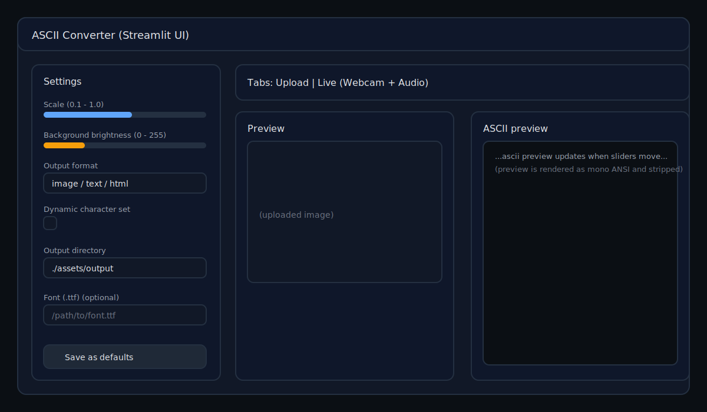
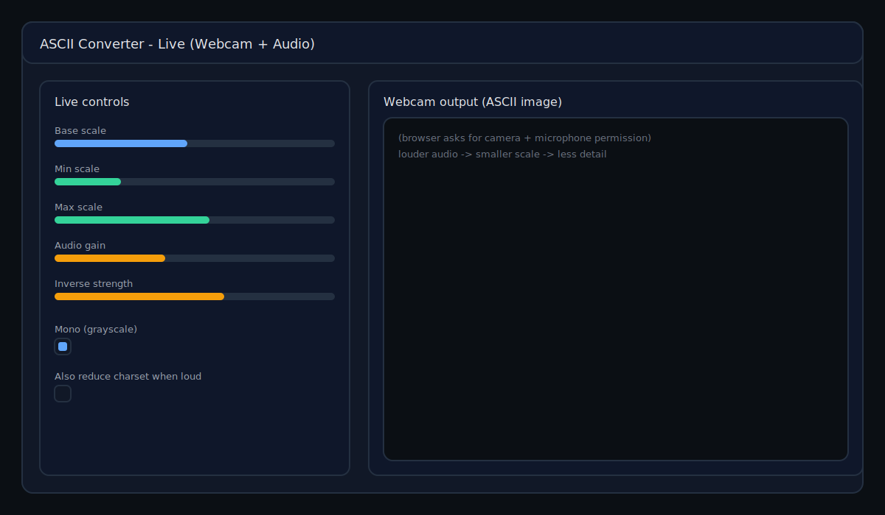

# ASCII Convert Script

Convert images into colorized ASCII art. Each pixel is mapped to a character
whose "ink" coverage approximates the pixel brightness.

Screenshots (UI overview)




## Installation

```bash
python -m pip install -r requirements.txt
```

Minimal (CLI only):
```bash
python -m pip install pillow
```

Optional features require:
- `tqdm` adds a progress bar to the CLI.
- `streamlit` enables the GUI.
- `streamlit-webrtc` + `numpy` enable the Live (Webcam + Audio) tab.

## Command line usage

```bash
python -m ascii_art.cli --input "image.jpg" --scale 0.2 --brightness 30 --format image
```

Notes
- `--input` can be either:
  - a file name located in `assets/input/` (example: `--input "image.jpg"`), or
  - an absolute path to an image (example: `--input "/abs/path/image.jpg"`).
- If you want to pass a relative path outside `assets/input/`, use an absolute
  path instead (the CLI currently validates `--input` in a way that can reject
  other relative paths).
- By default, outputs are written to `assets/output/` (gitignored) unless you
  pass `--output-dir`.

### Options

Core
- `--input <name-or-abs-path>`: input image (see notes above).
- `--batch <directory>`: convert every file in a directory.
- `--output-dir <dir>`: where outputs are written (default from `config.ini`).
- `--format {image,text,html,ansi}`:
  - `image`: write a PNG
  - `text`: write a UTF-8 `.txt`
  - `html`: write a UTF-8 `.html` with colored spans
  - `ansi`: write ANSI-colored output to stdout (no files written)

Rendering
- `--scale <float>`: output scaling factor (0 < scale <= 1).
- `--brightness <int>`: background brightness (0-255).
- `--mono`: render in grayscale instead of color.
- `--grayscale {avg,luma601,luma709}`: brightness mapping used for character
  selection (default: `avg`).
  - `avg`: `(r + g + b) / 3` (current behavior)
  - `luma601`: BT.601 approximation (weights favor green)
  - `luma709`: BT.709 approximation (weights favor green even more)
  Example for a pure red pixel `(255,0,0)`:
  - `avg` -> 85
  - `luma601` -> 76
  - `luma709` -> 53

Character set / fonts
- `--dynamic-set`: generate a brightness-ranked character set via `ascii_art.charset`.
- `--font <path>`: optional TTF font path (used for dynamic set generation and
  for rendering characters when writing images).

Video/webcam
- `--video <path>`: convert frames from a video file.
- `--webcam`: convert frames from the default webcam.

If no `--input` is supplied the program will prompt for a file from
`assets/input`.

### Examples

Convert an image from `assets/input/` to an output PNG
```bash
python -m ascii_art.cli --input "IMG20230214135212.jpg" --scale 0.2 --brightness 30 --format image
```

Render ANSI output directly in your terminal
```bash
python -m ascii_art.cli --input "IMG20230214135212.jpg" --scale 0.2 --format ansi
```

Convert a whole directory
```bash
python -m ascii_art.cli --batch "assets/input" --format text --output-dir "assets/output"
```

Use a custom font and a dynamically generated character set
```bash
python -m ascii_art.cli --input "IMG20230214135212.jpg" --dynamic-set --font "/path/to/font.ttf" --format image
```

## GUI usage

Launch the Streamlit interface with:

```bash
python -m ascii_art.gui
```

This will start a local Streamlit server and open a browser window.

You can also run it directly:
```bash
streamlit run ascii_art/streamlit_gui.py
```

Use the uploader (supports drag and drop), adjust the scale/brightness, and the
ASCII preview will update automatically.

### GUI walkthrough

The Streamlit app has two tabs:
- Upload: convert one or more images you upload.
- Live (Webcam + Audio): convert your webcam feed in real time.

Settings are in the left sidebar. Clicking "Save as defaults" persists them to
`config.json` for the next launch.

Output files (Upload tab)
- Files are written to your chosen output directory and follow this naming:
  `O_h_<brightness>_f_<scale>_<basename>.<ext>`
- Example: `O_h_30_f_0.2_IMG20230214135212.png`

#### Upload tab

Flow
- Upload one or more images.
- Select an image to preview.
- Adjust the sliders.
- Click "Convert all uploads" to write outputs to disk and download them.

Controls

Scale (slider)
- What it does: controls output resolution (number of characters).
  Internally the image is resized to:
  - `new_width_chars = int(scale * input_width_px)`
  - `new_height_chars = int(scale * input_height_px * (ONE_CHAR_WIDTH / ONE_CHAR_HEIGHT))`
- How it feels: lower scale = fewer characters = faster + less detail; higher
  scale = more characters = slower + more detail.
- Example (1920x1080 input):
  - `scale=0.20` -> ~384 columns and ~120 rows
  - `scale=0.50` -> ~960 columns and ~300 rows
  If you output `format=image`, the rendered PNG is those counts multiplied by
  the character cell size (10x18 px by default).

Background brightness (slider)
- What it does: sets the background color behind the ASCII characters.
  - `format=image`: background fill color of the output PNG.
  - `format=html`: `<body>` background color.
  - `format=text`: no background (it's plain text).
- What it does not do: it does not change the brightness-to-character mapping.
- Examples:
  - `brightness=0`: black background (best in terminals/dark pages)
  - `brightness=30`: dark gray background (default)
  - `brightness=255`: white background (print-friendly)

Output format (select)
- `image`: writes a `.png` with characters drawn in the original pixel colors.
- `text`: writes a UTF-8 `.txt` (no color).
- `html`: writes a UTF-8 `.html` with per-character colored `<span>` tags.

Grayscale mode (select)
- What it does: chooses how RGB pixels are reduced to a single brightness value
  for selecting ASCII characters.
- Options:
  - `avg`: average of channels (default)
  - `luma601`: closer to perceived brightness (BT.601)
  - `luma709`: closer to perceived brightness (BT.709)
- Example for a pure red pixel `(255,0,0)`: `avg=85`, `luma601=76`, `luma709=53`.

Dynamic character set (checkbox)
- What it does: generates a brightness-ranked character set using
  `ascii_art/charset.py` (it renders glyphs and sorts them by ink coverage).
- When to use it: if you switch fonts or want a more consistent "light to dark"
  ramp for a specific font.
- Example:
  - Off: uses the built-in `converter.char_array`.
  - On + a monospace TTF: recomputes a character ordering tailored to that font.

Output directory (text input)
- What it does: where generated files are written.
- Example: `./assets/output` (default, gitignored).

Font path (.ttf) (text input / uploader)
- What it does: optional font used for:
  - rendering characters in `format=image`, and
  - dynamic character set generation (when enabled).
- Example: `--font "/path/to/DejaVuSansMono.ttf"` equivalent in the GUI.

Note on the preview
- The "ASCII preview" is rendered via an internal ANSI conversion and stripped
  back to plain text; it is intentionally a quick, readable preview.

Example settings (Upload tab)
- Fast draft: `scale=0.15`, `brightness=30`, `format=text`
- Balanced: `scale=0.25`, `brightness=20`, `format=image`
- High detail (large outputs): `scale=0.45`, `brightness=0`, `format=html`

#### Live tab (Webcam + Audio)

Live mode renders the webcam frames as an ASCII image stream.

The sidebar "Background brightness" setting also applies to Live mode.

Audio is used to modulate detail inversely:
- louder sound -> smaller scale -> fewer characters -> less detail

Base scale (slider)
- What it does: the starting scale used when audio is quiet.
- Example: `base_scale=0.15` is a good starting point for most webcams.

Min scale (slider)
- What it does: lower clamp for the dynamically computed scale.
- When to use it: if the feed gets too blocky when it's loud, raise this.
- Example: set `min_scale=0.08` to prevent extreme coarsening.

Max scale (slider)
- What it does: upper clamp for the dynamically computed scale.
- When to use it: if the feed is too slow/heavy when it's quiet, lower this.

Audio gain (slider)
- What it does: scales microphone RMS into a 0..1 level.
  Internally: `level = clamp(rms * audio_gain, 0, 1)`.
- How it feels: higher gain makes the app react to quieter sounds.
- Example:
  - if `rms=0.02` and `audio_gain=12`, `level=0.24`
  - if `audio_gain=50`, the same `rms` saturates faster (`level=1.0`)

Inverse strength (slider)
- What it does: how strongly (and how quickly) audio reduces detail.
  Internally: `lvl = clamp(level * inverse_strength, 0, 1)` and
  `scale = base_scale / (1 + lvl)` (then clamped by min/max).
- Example:
  - `base_scale=0.15`, `level=0.24`, `inverse_strength=3.0`
  - `lvl=0.72`, so `scale=0.15 / 1.72 ~= 0.087`

Mono (grayscale) (checkbox)
- What it does: renders the live output in grayscale instead of color.

Also reduce charset when loud (checkbox)
- What it does: optionally reduces the number of characters used when audio is
  loud (in addition to scale changes). Fewer characters = chunkier look.

Min charset size (slider, shown only when enabled)
- What it does: lower bound for how small the character set is allowed to get.
- Example: `min charset size = 16` keeps some tonal variety even when loud.

Charset reduction strength (slider, shown only when enabled)
- What it does: controls how aggressively the charset shrinks with audio.
  Internally it reduces `len(char_array)` roughly like:
  `size ~= len(char_array) / (1 + level * strength)`.
- Example: if `len(char_array)=200`, `level=0.5`, `strength=3`, then
  `size ~= 200 / (1 + 1.5) = 80` (clamped to your min).

Example settings (Live tab)
- Speech-reactive (good starting point):
  - `base_scale=0.15`, `min_scale=0.07`, `max_scale=0.25`, `audio_gain=12`, `inverse_strength=3`
- Very reactive (performance art):
  - `base_scale=0.20`, `min_scale=0.06`, `max_scale=0.30`, `audio_gain=25`, `inverse_strength=6`
- Add chunkiness on loud sounds:
  - enable "Also reduce charset when loud"
  - `min charset size=16`, `charset reduction strength=3`

Live mode
- Open the "Live (Webcam + Audio)" tab to convert a webcam feed in real time.
- The microphone level inversely modulates detail (louder sound -> less detail).
- Your browser will prompt for camera/microphone permissions.

## Video and webcam

Video/webcam conversion requires extra dependencies that are not listed in
`requirements.txt`:

```bash
python -m pip install opencv-python imageio
```

Example
```bash
python -m ascii_art.cli --video "/path/to/movie.mp4" --scale 0.2 --format image
```

## Generating custom character sets

`ascii_art/charset.py` exposes `generate_char_array` which analyses each glyph of
a font and sorts characters by coverage. The CLI `--dynamic-set` flag leverages
this function automatically.

## Configuration

- CLI defaults live in `config.ini` and are used when flags are omitted.
- GUI settings are persisted to `config.json` (delete it to reset).

## Testing

Run the unit tests with:

```bash
pytest
```

Run a single test
```bash
pytest tests/test_ascii.py::test_convert_image_text_output
```

## Troubleshooting

- Streamlit not found: `python -m pip install streamlit`.
- Live tab shows a missing dependency error: install
  `python -m pip install streamlit-webrtc numpy` (and ensure your system can
  build/install PyAV if needed).
- No webcam/video: your browser may be blocking camera access; check site
  permissions and reload the app.
- `--format ansi` is meant for terminal display; it prints to stdout and does
  not create output files.

## Contributing

Issues and pull requests are welcome.
See `CONTRIBUTING.md` for dev workflows.

## License

MIT
